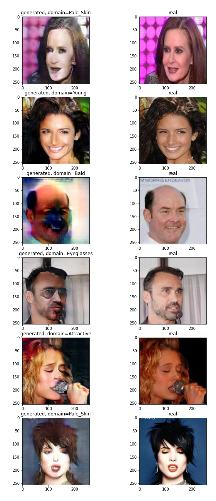
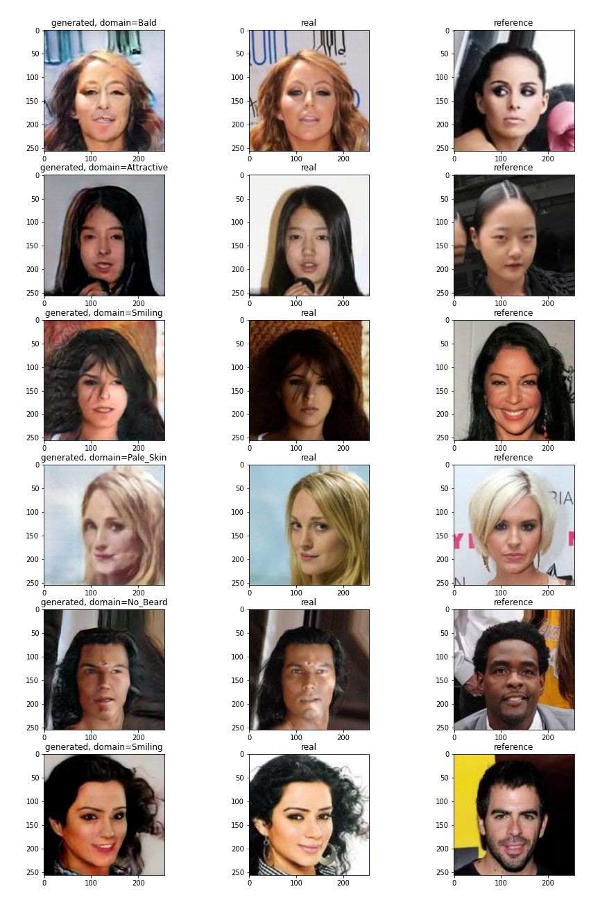
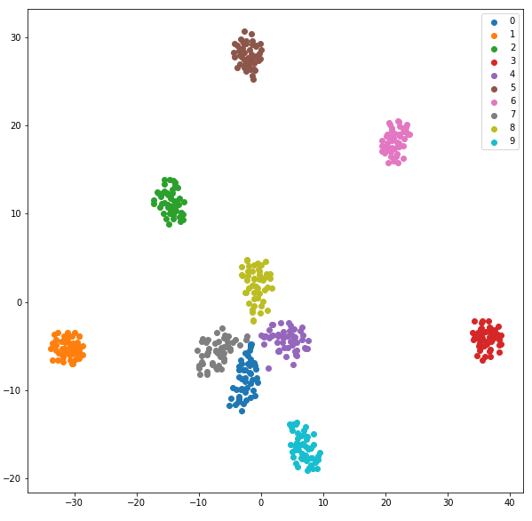

# StarGAN v2 for Celeba dataset
It is implementation of [this](https://arxiv.org/abs/1912.01865) paper for CelebA dataset.
## Examples of generated images
Due to the lack of computational resources I trained this network only for 24k iterations with batch size equals to 2, while in the original paper for dataset with only 2 domains (I have 10) they trained it for 100k iterations with batch size equals to 8. But despite my not-so-good results, it is seen that generator "understands" style domains.

Examples with images generated from latent vector:

Examples with images generated from references:

Also if analyze latent space it is seen, that domains are perfectly distinguishable:

